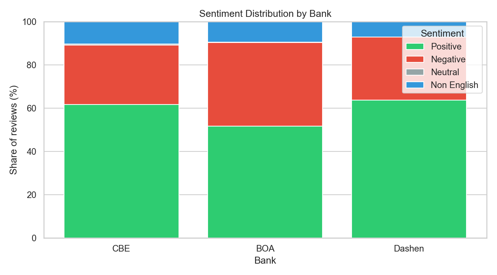
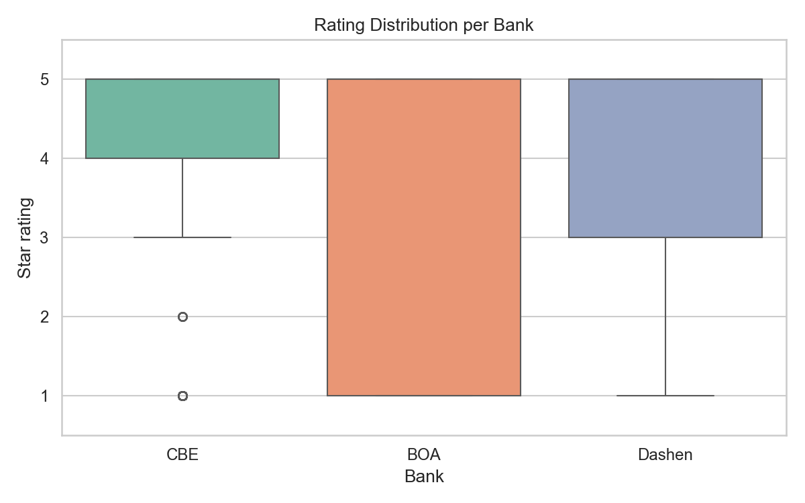
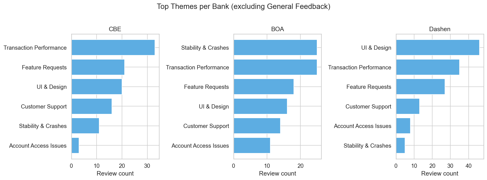
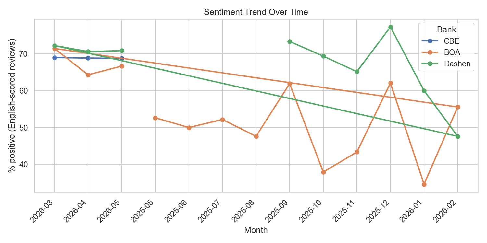
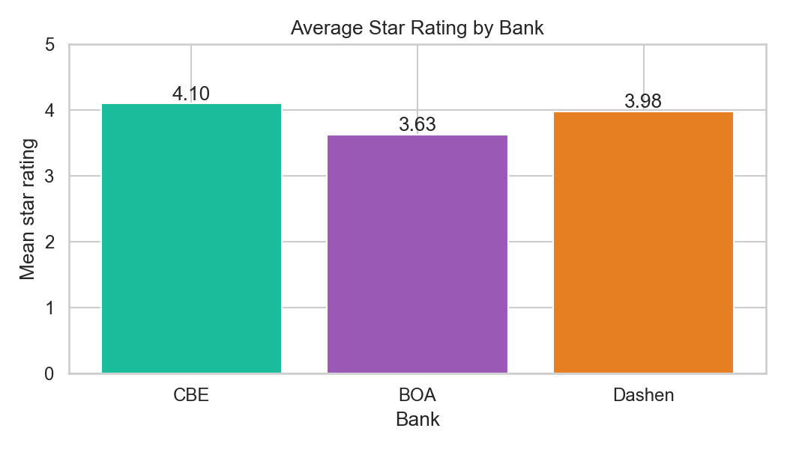

# Fintech Mobile Banking: Insights & Recommendations

*Omega Consultancy — Play Store review analysis for CBE, Bank of Abyssinia, and Dashen Bank.*

**Dataset:** 1,277 cleaned reviews | **Period:** 2025-05-06 to 2026-05-17 | **Source:** Google Play (Ethiopia)

---

## Executive summary

- **Highest rated:** CBE (mean 4.1 stars).
- **Lowest rated:** BOA (mean 3.63 stars).
- **Sentiment:** DistilBERT on English reviews; Amharic/mixed labeled `non_english`.
- **Themes:** TF-IDF + keyword rules across six business categories.

---

## Cross-bank comparison

| Bank | Reviews | Avg rating | % Positive | % Negative | Top themed issue |
|------|---------|------------|------------|------------|------------------|
| CBE | 412 | 4.1 | 61.7% | 27.4% | Transaction Performance |
| BOA | 432 | 3.63 | 51.6% | 38.7% | Transaction Performance |
| Dashen | 433 | 3.98 | 63.7% | 29.1% | UI & Design |

---

## Commercial Bank of Ethiopia (CBE)

### Satisfaction drivers

### Driver 1: Intuitive UI and ease of use

15 positive UI & Design reviews (3.6% of CBE reviews).

**Sample reviews:**

> "easy and fast"

> "it's fast and easy nice"

### Driver 2: Responsive customer support

11 positive Customer Support mentions (2.7% of reviews).

**Sample reviews:**

> "i like cbe service"

> "excellent service"

### Driver 3: Speed and reliability

20 positive reviews cite speed/ease/reliability (4.9% of reviews).

**Sample reviews:**

> "fast and time saving..."

> "easygoing & Convenient to use."

### Pain points

### Pain point 1: Slow or failed transactions

25 negative Transaction Performance reviews (6.1% of reviews).

**Sample reviews:**

> "notwork totransferto other"

> "it's v good app sometimes there is a problem on other bank transfers"

### Pain point 2: App crashes and instability

10 negative Stability & Crashes reviews (2.4% of reviews).

**Sample reviews:**

> "I can't use the app months ago. It stopped working with Mobile data and WiFi. I didn't know the cause. Why this app is not compatible wit..."

> "I like it but sometimes there is a system error"

### Recommendations

- **[P1]** Invest in transfer/payment performance: add end-to-end transaction tracing, proactive push notifications on pending/failed payments, and a dedicated "payment status" screen for CBE users.  
  *Evidence:* Transaction Performance is a top negative theme in review data.

- **[P1]** Launch a stability sprint for CBE: crash reporting (Firebase/Crashlytics), device/OS matrix testing, and hotfix channel for force-close issues.  
  *Evidence:* Stability & Crashes appears frequently in negative reviews (esp. BOA).

- **[P2]** Protect CBE's UI strengths: usability testing on major flows, dark mode, and accessibility (font size, Amharic/English toggle).  
  *Evidence:* UI & Design is a documented satisfaction driver.

- **[P3]** Scale in-app chat and branch callback for CBE; promote support channels where positive Customer Support reviews cluster.  
  *Evidence:* Customer Support cited positively in themed reviews.

---

## Bank of Abyssinia (BOA)

### Satisfaction drivers

### Driver 1: Intuitive UI and ease of use

5 positive UI & Design reviews (1.2% of BOA reviews).

**Sample reviews:**

> "it is simple and fast app"

> "fast and simple"

### Driver 2: Responsive customer support

10 positive Customer Support mentions (2.3% of reviews).

**Sample reviews:**

> "office branches have to improve their services please"

> "excellent service"

### Driver 3: Speed and reliability

12 positive reviews cite speed/ease/reliability (2.8% of reviews).

**Sample reviews:**

> "fast"

> "fast security 🔥🔥🔥"

### Pain points

### Pain point 1: Slow or failed transactions

24 negative Transaction Performance reviews (5.6% of reviews).

**Sample reviews:**

> "i can't transfer money to other bank. 😒😒"

> "i m sorry but it doesn't work for my android it is too slow but other bank are very fast please update"

### Pain point 2: App crashes and instability

25 negative Stability & Crashes reviews (5.8% of reviews).

**Sample reviews:**

> "the app not works on samsung galaxy A06 models it's directly kick you out of the app whenever u want to use it amd and then it's says the..."

> "it is not working on redminote 11 pro+ pls fix it"

### Pain point 3: Login, OTP, and account access failures

9 negative Account Access Issues (2.1% of reviews).

**Sample reviews:**

> "i entered incorrect security question by mistake boa app lock pin forever, why is there no other options? ?? i contacted different branch..."

> "when i try to see my balance the app logs me out.i try to uninstall the app and install it when i try to login again it says login expire..."

### Recommendations

- **[P1]** Invest in transfer/payment performance: add end-to-end transaction tracing, proactive push notifications on pending/failed payments, and a dedicated "payment status" screen for BOA users.  
  *Evidence:* Transaction Performance is a top negative theme in review data.

- **[P1]** Launch a stability sprint for BOA: crash reporting (Firebase/Crashlytics), device/OS matrix testing, and hotfix channel for force-close issues.  
  *Evidence:* Stability & Crashes appears frequently in negative reviews (esp. BOA).

- **[P1]** Redesign OTP/login flow for BOA: SMS fallback, clearer error messages, and in-app "resend OTP" with rate-limit transparency.  
  *Evidence:* Account Access Issues and OTP/login keywords in negative reviews.

- **[P2]** Protect BOA's UI strengths: usability testing on major flows, dark mode, and accessibility (font size, Amharic/English toggle).  
  *Evidence:* UI & Design is a documented satisfaction driver.

---

## Dashen Bank (Dashen)

### Satisfaction drivers

### Driver 1: Intuitive UI and ease of use

40 positive UI & Design reviews (9.2% of Dashen reviews).

**Sample reviews:**

> "easy to use, friendly"

> "The Dashen Super App is very impressive. It is fast, easy to use, and provides smooth access to all essential banking services. Money tra..."

### Driver 2: Responsive customer support

8 positive Customer Support mentions (1.8% of reviews).

**Sample reviews:**

> "The most realistic and modernized financial service in ethiopia i recommend every individual to use this application probably. Always one..."

> "your service is too good"

### Driver 3: Speed and reliability

39 positive reviews cite speed/ease/reliability (9.0% of reviews).

**Sample reviews:**

> "Super Up is the ultimate digital banking app, living up to its name with speed, efficiency, and innovation. Designed for a seamless exper..."

> "App That makes cashless society in our century and Easy to use."

### Pain points

### Pain point 1: Slow or failed transactions

23 negative Transaction Performance reviews (5.3% of reviews).

**Sample reviews:**

> "Very disappointing app. Other bank transfers don’t work at all I keep getting errors. It’s slow, unreliable, and frustrating Please fix t..."

> "The most unreliable, frustrating and worst app I have ever used! imagine being in a restaurant and trying paying bills, but not processin..."

### Pain point 2: App crashes and instability

5 negative Stability & Crashes reviews (1.2% of reviews).

**Sample reviews:**

> "it is not working"

> "Before the recent update, this app was great. Now, the home page is cluttered with promotions and banners, which really hurts the experie..."

### Pain point 3: Login, OTP, and account access failures

8 negative Account Access Issues (1.8% of reviews).

**Sample reviews:**

> "I am experiencing a serious issue with the Dashen Super App. I visited a branch and my account was successfully activated. However, short..."

> "it takes time to login. but after login its good but sometimes unexpected termination occur in which rises untrust to use usually the app..."

### Recommendations

- **[P1]** Invest in transfer/payment performance: add end-to-end transaction tracing, proactive push notifications on pending/failed payments, and a dedicated "payment status" screen for Dashen users.  
  *Evidence:* Transaction Performance is a top negative theme in review data.

- **[P1]** Launch a stability sprint for Dashen: crash reporting (Firebase/Crashlytics), device/OS matrix testing, and hotfix channel for force-close issues.  
  *Evidence:* Stability & Crashes appears frequently in negative reviews (esp. BOA).

- **[P1]** Redesign OTP/login flow for Dashen: SMS fallback, clearer error messages, and in-app "resend OTP" with rate-limit transparency.  
  *Evidence:* Account Access Issues and OTP/login keywords in negative reviews.

- **[P2]** Protect Dashen's UI strengths: usability testing on major flows, dark mode, and accessibility (font size, Amharic/English toggle).  
  *Evidence:* UI & Design is a documented satisfaction driver.

---

## Ethics and limitations

- Negativity bias: Play Store reviewers often post after a bad experience; sentiment and themes may over-represent problems versus silent satisfied users.
- English-only sentiment: Amharic and mixed-language reviews are labeled `non_english` without a transformer score; English-only scraping (`lang=en`) under-samples Amharic feedback.
- Temporal sampling: Reviews span roughly one year (scrape window); seasonal campaigns or app releases may skew theme counts.
- Keyword themes: Rule-based themes miss nuance; sarcasm and context can be misclassified.
- Survivorship: Users who uninstall without reviewing are invisible in this dataset.

---

*Report generated by `scripts/generate_insights_report.py` (Task 4).*